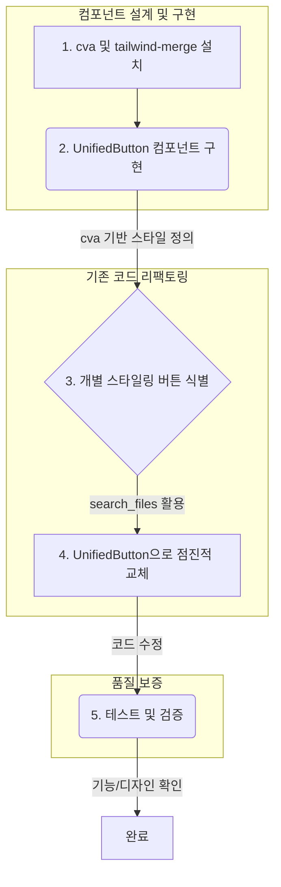

## 버튼 스타일 리팩토링 계획

### 1. 현황 분석

**가. 공통 컴포넌트 현황:**

*   `src/components/Button.tsx`: `<button>` 요소 렌더링. `variant`, `size`, `iconLeft`, `iconRight` 등의 props로 스타일 제어.
*   `src/components/LinkButton.tsx`: `next/link` 기반의 `<a>` 요소 렌더링. `Button.tsx`와 유사한 props 구조를 가지며, `outlineWhite` variant 추가됨.
*   **문제점:** `search_files` 결과, `Button` 및 `LinkButton` 컴포넌트는 프로젝트 내에서 **실제로 사용되지 않고 있습니다.**

**나. 버튼 스타일 적용 방식:**

*   `search_files` 결과, `<button>` 태그도 직접 사용되지 않습니다.
*   `bg-primary` 클래스 검색 결과, `src/components/ContactFormSections/SubmissionSection.tsx` 등에서 **`<button>` 태그에 직접 Tailwind CSS 유틸리티 클래스를 적용**하여 버튼 스타일을 구현하는 사례를 확인했습니다.
    *   예시 (`SubmissionSection.tsx`의 제출 버튼):
        ```html
        <button
          type="submit"
          className="bg-primary hover:bg-orange-500 text-text-on-primary font-bold py-3 px-10 rounded-lg text-lg transition duration-300 disabled:opacity-50 disabled:cursor-not-allowed hover:-translate-y-px focus:outline-none focus:ring-2 focus:ring-primary focus:ring-offset-2 focus:ring-offset-background-main flex items-center justify-center min-w-[180px]"
          disabled={isSubmitting}
        >
          {/* ... 아이콘 및 텍스트 ... */}
        </button>
        ```
*   **문제점:**
    *   **스타일 불일치:** 공통 컴포넌트(`Button.tsx`)의 스타일 정의와 개별 스타일링된 버튼(`SubmissionSection.tsx`) 간에 차이 존재 (예: padding, 아이콘 처리 방식, 최소 너비 등).
    *   **관리 어려움:** 버튼 스타일 변경 시 프로젝트 전체에 흩어져 있는 개별 스타일링 코드를 모두 찾아 수정해야 하므로 유지보수 비용 증가.
    *   **재사용성 저하:** 일관된 버튼 컴포넌트 부재로 코드 중복 발생 가능성.

### 2. 리팩토링 계획

**가. 목표:**

*   일관되고 관리하기 쉬운 버튼 시스템 구축.
*   `cva` (Class Variance Authority) 라이브러리를 도입하여 버튼 스타일 관리를 효율화.
*   기존의 개별 스타일링된 버튼들을 새로운 통합 컴포넌트로 교체.

**나. 통합 버튼 컴포넌트 설계 (`UnifiedButton.tsx` - 가칭):**

*   **핵심 기능:**
    *   `cva`를 사용하여 `variant`, `size`, `isLoading` 등 다양한 상태에 따른 Tailwind CSS 클래스 조합을 관리.
    *   `tailwind-merge` 라이브러리를 함께 사용하여 전달된 `className`과의 클래스 충돌 방지 및 병합.
    *   `as` prop 또는 유사한 메커니즘을 통해 `<button>` 또는 `<a>` (Next.js의 `Link` 컴포넌트 포함) 렌더링을 동적으로 결정.
*   **주요 Props:**
    *   `variant`: `primary`, `secondary`, `outline`, `outlineWhite`, `ghost`, `link`, `kakao`, `naver` 등 (기존 `Button`, `LinkButton` 및 개별 스타일링 사례 기반 정의)
    *   `size`: `sm`, `base`, `lg` (기존 정의 활용 및 필요시 확장)
    *   `iconLeft`, `iconRight`: `React.ReactNode` 타입으로 아이콘 컴포넌트 전달.
    *   `isLoading`: `boolean` 타입. `true`일 경우 로딩 스피너 표시 및 버튼 비활성화.
    *   `href`: `string` 타입. 제공될 경우 `<a>` 또는 `Link`로 렌더링.
    *   `disabled`: `boolean` 타입.
    *   `className`: 추가적인 Tailwind 클래스 또는 커스텀 스타일 적용.
    *   `...props`: 나머지 `button` 또는 `a` 태그의 네이티브 속성 지원.

**다. 리팩토링 절차:**



1.  **라이브러리 설치:**
    ```bash
    npm install class-variance-authority tailwind-merge
    ```
2.  **`UnifiedButton` 컴포넌트 구현:**
    *   `cva`를 사용하여 버튼 스타일 variant 정의 (`buttonVariants`).
    *   `as` prop 또는 조건부 렌더링 로직 구현 (`href` 유무에 따라 `Link` 또는 `button` 렌더링).
    *   `isLoading` 상태 처리 로직 추가 (스피너 아이콘 표시).
    *   `tailwind-merge`를 사용하여 클래스 병합.
3.  **개별 스타일링 버튼 식별:**
    *   `search_files` 도구를 사용하여 프로젝트 전체에서 버튼으로 사용되는 요소 패턴 검색.
        *   예: `<button className="...">`, `<a className="...">` 중 `bg-primary`, `border`, `rounded-lg`, `py-`, `px-` 등이 조합된 경우.
        *   검색 정규식 예시: `className=".*(bg-primary|border|rounded-lg).*(py-\d+|px-\d+).*"` (정확한 패턴은 실제 코드 분석 후 조정 필요)
4.  **`UnifiedButton`으로 점진적 교체:**
    *   식별된 각 버튼을 `UnifiedButton` 컴포넌트로 교체.
    *   기존 스타일과 기능(variant, size, 아이콘, 링크 여부, 로딩 상태 등)에 맞춰 `UnifiedButton`의 props를 정확하게 설정.
    *   예시 (`SubmissionSection.tsx`의 제출 버튼 교체):
        ```diff
        - <button
        -   type="submit"
        -   className="bg-primary hover:bg-orange-500 text-text-on-primary font-bold py-3 px-10 rounded-lg text-lg transition duration-300 disabled:opacity-50 disabled:cursor-not-allowed hover:-translate-y-px focus:outline-none focus:ring-2 focus:ring-primary focus:ring-offset-2 focus:ring-offset-background-main flex items-center justify-center min-w-[180px]"
        -   disabled={isSubmitting}
        - >
        -   {isSubmitting ? (
        -     <>
        -       <HiArrowPath className="animate-spin h-5 w-5 mr-2" />
        -       전송 중...
        -     </>
        -   ) : (
        -     <span className="flex items-center">
        -       <HiPaperAirplane className="h-5 w-5 mr-3" />
        -       문의하기
        -     </span>
        -   )}
        - </button>
        + <UnifiedButton
        +   type="submit"
        +   variant="primary"
        +   size="lg" // 또는 커스텀 size 정의 필요
        +   isLoading={isSubmitting}
        +   iconLeft={!isSubmitting ? <HiPaperAirplane className="h-5 w-5" /> : undefined}
        +   className="px-10 min-w-[180px]" // 필요한 커스텀 스타일 추가
        +   disabled={isSubmitting}
        + >
        +   {isSubmitting ? '전송 중...' : '문의하기'}
        + </UnifiedButton>
        ```
5.  **테스트 및 검증:**
    *   교체된 모든 버튼의 기능(클릭, 링크 이동, 비활성화, 로딩 상태) 및 디자인(크기, 색상, 아이콘, 반응형) 확인.
    *   다양한 브라우저 및 디바이스 환경에서 테스트 수행.

**라. 예상 작업 범위:**

*   `UnifiedButton` 컴포넌트 신규 개발 (1~2일).
*   개별 스타일링 버튼 식별 및 분석 (프로젝트 규모에 따라 0.5~1일).
*   식별된 버튼 교체 작업 (파일 수 및 복잡도에 따라 2~5일 이상 소요될 수 있음).
*   테스트 및 QA (1~2일).
*   **총 예상 기간:** 약 1주 ~ 2주 (작업자 숙련도 및 프로젝트 복잡성에 따라 변동 가능).