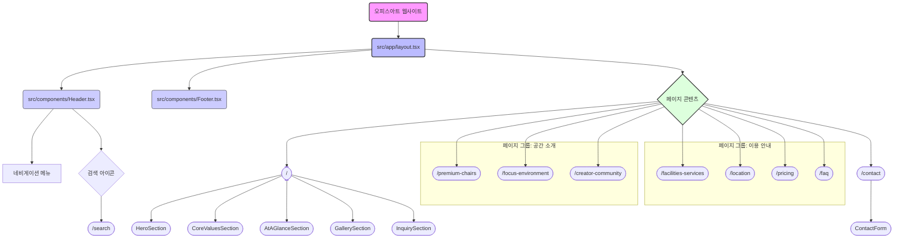

# 웹사이트 분석 계획

**1. 개요**

*   **프로젝트명**: 오피스아트 웹사이트 (`officeart-website`)
*   **기술 스택**: Next.js (v14.2.4), React (v18.2.0), TypeScript, Tailwind CSS
*   **주요 기능**: 공간 소개, 이용 안내, 상담 및 문의, 웹사이트 내 검색
*   **구조**: Next.js App Router 기반, 서버 컴포넌트와 클라이언트 컴포넌트 활용

**2. 디렉토리 구조 (주요 항목)**

*   `public/`: 정적 에셋 (이미지, 폰트 등)
    *   `public/images/gallery/`: 갤러리 이미지
    *   `public/images/logo/`: 로고 이미지
    *   `public/fonts/`: 로컬 폰트 파일
*   `src/`: 소스 코드
    *   `src/app/`: Next.js App Router 페이지 및 레이아웃
        *   `src/app/layout.tsx`: 전역 레이아웃 (폰트, 메타데이터, 헤더/푸터 포함)
        *   `src/app/page.tsx`: 홈페이지
        *   `src/app/(pages)/page.tsx`: 각 서브 페이지 (예: `src/app/premium-chairs/page.tsx`)
    *   `src/components/`: 재사용 가능한 UI 컴포넌트
        *   `src/components/Header.tsx`: 네비게이션 헤더
        *   `src/components/Footer.tsx`: 푸터
        *   `src/components/HeroSection.tsx`, `src/components/CoreValuesSection.tsx` 등: 홈페이지 및 기타 페이지 구성 섹션
        *   `src/components/ContactForm.tsx`: 문의 폼
    *   `src/types/`: TypeScript 타입 정의 (예: `src/types/contactForm.ts`)
    *   `src/fonts/`: (현재는 `public/fonts` 사용 중, `src/fonts/GmarketSansMedium.woff` 파일 존재)

**3. 주요 페이지 및 예상 콘텐츠**

| 메뉴 경로                 | 파일 경로 (예상)                         | 주요 내용/기능                                                                 | 관련 컴포넌트 (예상)                                                                                                                               |
| :------------------------ | :--------------------------------------- | :----------------------------------------------------------------------------- | :------------------------------------------------------------------------------------------------------------------------------------------------- |
| `/` (홈페이지)            | `src/app/page.tsx`                     | 서비스 소개, 핵심 가치, 공간 둘러보기, 문의 유도                                 | `HeroSection`, `CoreValuesSection`, `AtAGlanceSection`, `GallerySection`, `InquirySection` |
| `/premium-chairs`         | `src/app/premium-chairs/page.tsx` | 프리미엄 의자 소개, 종류, 특징                                                 | `PremiumChairsClient`, `ChairComparisonChart`                                                              |
| `/focus-environment`      | `src/app/focus-environment/page.tsx` | 집중 환경 조성 요소 (책상, 조명 등) 소개                                       | 관련 정보 표시 컴포넌트                                                                                                                              |
| `/creator-community`      | `src/app/creator-community/page.tsx` | 크리에이터 커뮤니티 소개, 네트워킹, 이벤트 등                                  | `CreatorCommunityClient`, `CreatorChart`                                                                |
| `/facilities-services`    | `src/app/facilities-services/page.tsx` | 제공 시설 (OA존, 미팅룸 등) 및 서비스 안내                                     | 관련 정보 표시 컴포넌트                                                                                                                              |
| `/location`               | `src/app/location/page.tsx`           | 오피스 위치, 지도, 교통편 안내                                                 | 지도 API 연동 컴포넌트 (예상)                                                                                                                        |
| `/pricing`                | `src/app/pricing/page.tsx`             | 가격 정책, 멤버십 종류 및 혜택 안내                                            | `PricingClient`                                                                                                                                |
| `/faq`                    | `src/app/faq/page.tsx`                     | 자주 묻는 질문과 답변                                                          | FAQ 목록 컴포넌트                                                                                                                                  |
| `/contact`                | `src/app/contact/page.tsx`             | 상담 및 문의 양식, 연락처 정보                                                 | `ContactForm` (내부적으로 `PersonalInfoSection`, `VisitInfoSection`, `InquiryDetailsSection`, `SubmissionSection` 사용) |
| `/search`                 | `src/app/search/page.tsx`               | 웹사이트 내 검색 결과 표시                                                     | 검색 결과 목록 컴포넌트, Fuse.js 활용 예상                                                                                                             |

**4. 주요 컴포넌트 역할**

*   `Header.tsx`: 전역 네비게이션, 로고, 검색 기능 제공
*   `Footer.tsx`: 저작권 정보, 관련 링크 등 제공
*   `Button.tsx`, `LinkButton.tsx`, `UnifiedButton.tsx`: 다양한 형태의 버튼 제공
*   `Card.tsx`: 정보 카드 UI
*   `Modal.tsx`: 모달창 UI
*   `ScrollAnimationWrapper.tsx`: 스크롤 애니메이션 효과 제공
*   `SplashScreen.tsx`: 초기 로딩 화면 (현재 `layout.tsx`에서 제거됨)

**5. 데이터 흐름 및 상태 관리 (예상)**

*   대부분의 페이지는 정적 콘텐츠 위주로 구성될 것으로 예상됩니다.
*   `ContactForm.tsx`에서는 `react-hook-form`을 사용하여 폼 상태를 관리하고, `@emailjs/browser`를 통해 이메일 전송 기능을 구현했을 가능성이 있습니다.
*   검색 기능은 `Fuse.js`를 사용하여 클라이언트 사이드 또는 서버 사이드 검색을 구현했을 수 있습니다.
*   클라이언트 컴포넌트(`'use client'`)는 사용자 인터랙션이 필요한 부분(예: 헤더 메뉴 토글, 검색창, 폼 입력)에 주로 사용됩니다.

**6. 웹사이트 구조도 (Mermaid Diagram)**

**7. 추가 확인 사항 (선택)**

*   각 페이지별 상세 컴포넌트 구조 및 props 전달 방식
*   상태 관리 라이브러리 사용 여부 (현재 `package.json`에서는 Zustand, Redux 등 명시적 라이브러리 없음)
*   API 연동 방식 (예: 문의사항 전송, 데이터 fetching)
*   테스트 코드 커버리지 (`BackButton.test.tsx` 외 다른 테스트 파일 존재 여부)