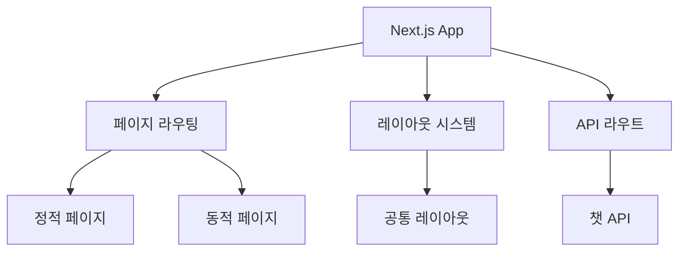

# 웹사이트 구조 분석 보고서

## 개요
오피스아트2는 프리미엄 사무실 가구 및 공간 솔루션을 제공하는 웹사이트로, Next.js 13+ 기반으로 구축되었습니다. 주요 기능으로는 갤러리, 문의하기, 커뮤니티 공간 등이 포함되어 있습니다.

## 기술 스택
- 프레임워크: Next.js 13+ (App Router 사용)
- 스타일링: Tailwind CSS
- 언어: TypeScript
- 배포: Vercel (CNAME 파일 존재 확인)
- 테스트: Jest (jest.config.js 설정 파일 확인)

## 아키텍처 다이어그램

## 주요 기능
1. **갤러리 시스템**
   - GallerySection, GallerySlider 컴포넌트로 구현
   - 다양한 사무실 공간 이미지展示
2. **문의 양식**
   - ContactForm 컴포넌트와 여러 하위 섹션으로 구성
   - PersonalInfoSection, VisitInfoSection 등
3. **커뮤니티 기능**
   - CreatorCommunityClient 컴포넌트로 구현
4. **공통 UI**
   - Header, Footer, Modal, Button 등 재사용 가능한 컴포넌트

## 스타일링 가이드
- Tailwind CSS 사용
- 주요 설정 파일: tailwind.config.js
- 커스텀 폰트: Gmarket Sans (Light, Medium, Bold)
- 반응형 디자인 적용

## 개선 제안
1. 컴포넌트 테스트 커버리지 확대 (현재 Jest 설정 존재하지만 테스트 파일 부족)
2. Storybook 도입 고려하여 컴포넌트 문서화
3. 성능 최적화를 위한 이미지 최적화 (WebP 변환 등)
4. API 라우트 타입 안정성 강화